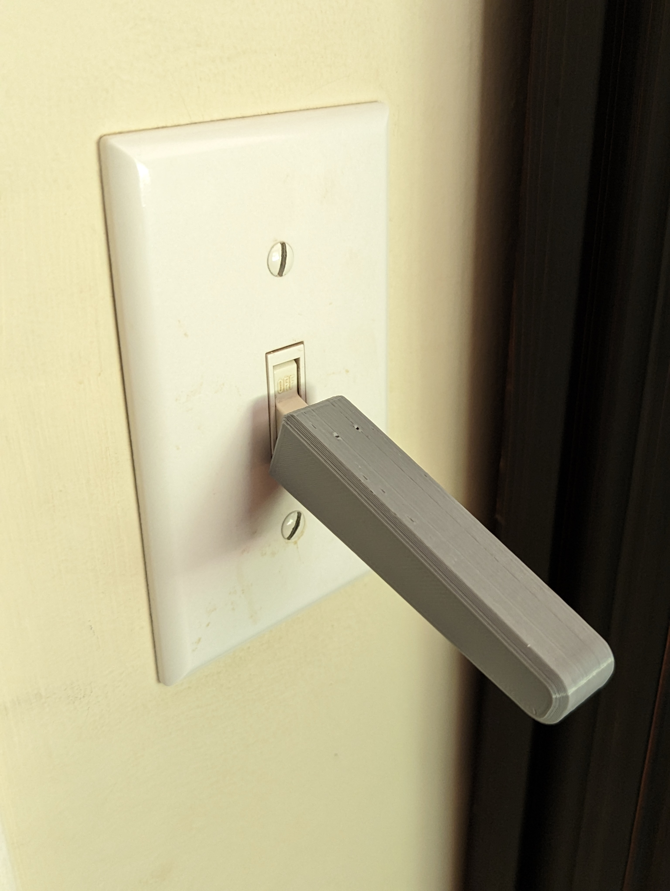

# Light Switch Extension Lever
The Light Switch Extension Lever is a lever designed to extend the toggle on a light switch. For some users with arthritis, limited grip strength or finger dexterity, it can be difficult to use a light switch. The Light Switch Extension Lever allows the user to flip the switch without needing any grip strength or nearly as much precision.

## More info at
- [Makers Making Change Project Page](https://makersmakingchange.com/project/light-switch-extension-lever/)

## How to Obtain a Light Switch Extension Lever
### 1. Do it Yourself (DIY) or Do it Together (DIT)

This is an open-source assistive technology, so anyone is free to build it. All of the files and instructions required to build the device are contained within this repository. Refer to the Maker Guide below.

### 2. Request a build of this device

If you would like to obtain a Light Switch Extension Lever, you may submit a build request through the [MMC Library Page](https://makersmakingchange.com/project/light-switch-extension-lever/). The requestor is responsible for the cost of materials and any shipping.

### 3. How to build this device for someone else

If you have the skills and equipment to build this device, and would like to donate your time to create the switch for someone who needs it, visit the [MMC Maker Wanted](https://makersmakingchange.com/maker-wanted/) section.

## Getting Started

### 1. Read through the Maker Guide

The Maker Guide outlines all the different instructions for creating the device.

### 2. Print the 3D Printable components

All of the files and individual print files can be in the [/Build_Files/3D_Printing_Files](/Build_Files/3D_Printing_Files/) folder.

### 3. Assemble the Light Switch Extension Lever

Reference the [User Guide](/Documentation/Light_Switch_Extension_Lever_User_Guide_V1.0.pdf) for the tools and steps required to build each portion.

## Files
### Documentation
| Document             | Version | Link |
|----------------------|---------|------|
| Design Rationale     | 1.0     | [Light_Switch_Extension_Lever_Design_Rationale](/Documentation/Light_Switch_Extension_Lever_Design_Rationale_V1.0.pdf)     |
| Maker Checklist      | 1.0     | [Light_Switch_Extension_Lever_Maker_Checklist](/Documentation/Light_Switch_Extension_Lever_Maker_Checklist_V1.0.pdf)     |
| Bill of Materials    | 1.0     | [Light_Switch_Extension_Lever_Bill_of_Materials](/Documentation/Light_Switch_Extension_Lever_BOM_V1.0.xlsx)     |
| 3D Printing Guide    | 1.0     | [Light_Switch_Extension_Lever_3D_Printing_Guide](/Documentation/Light_Switch_Extension_Lever_3D_Printing_Guide_V1.0.pdf)     |
| User Guide           | 1.0     | [Light_Switch_Extension_Lever_User_Guide](/Documentation/Light_Switch_Extension_Lever_User_Guide_V1.0.pdf)    |
| Changelog            | 1.0     | [Light_Switch_Extension_Lever_Changelog](/Documentation/Light_Switch_Extension_Lever_Changelog_V1.0.pdf)     |

### Design Files
 - [CAD Files](/Design_Files)

### Build Files
 - [3D Printing Files](/Build_Files/3D_Printing_Files)

## Attribution
Designers:
 - Initial Design by [Devon Smith](https://www.myminifactory.com/users/Devon_Smith) on [MyMiniFactory](https://www.myminifactory.com/object/3d-print-77490#google_vignette) and made available using a MyMiniFactory-Credit-Remix-Noncommercial license.
 - Further Design and Documentation by Neil Squire Society/Makers Making Change

## License
Everything needed or used to design, make, test, or prepare the Light Switch Extension Lever is licensed under the [MyMiniFactory - Credit - Remix - Noncommercial](https://www.myminifactory.com/object-licensing).

Accompanying material such as instruction manuals, videos, and other copyrightable works that are useful but not necessary to design, make, test, or prepare the Light Switch Extension Lever are published under a Creative Commons Attribution-ShareAlike 4.0 license https://creativecommons.org/licenses/by-sa/4.0/ (CC BY-SA 4.0).

---

<!-- ABOUT MMC START -->
## About Makers Making Change

Makers Making Change is a program of [Neil Squire](https://www.neilsquire.ca/), a Canadian non-profit that uses technology, knowledge, and passion to empower people with disabilities.

Makers Making Change leverages the capacity of community based Makers, Disability Professionals and Volunteers to develop and deliver affordable Open Source Assistive Technologies.

 - Website: [www.MakersMakingChange.com](https://www.makersmakingchange.com/)
 - GitHub: [makersmakingchange](https://github.com/makersmakingchange)
 - Bluesky: [@makersmakingchange.bsky.social](https://bsky.app/profile/makersmakingchange.bsky.social)
 - Instagram: [@makersmakingchange](https://www.instagram.com/makersmakingchange)
 - Facebook: [makersmakechange](https://www.facebook.com/makersmakechange)
 - LinkedIn: [Neil Squire Society](https://www.linkedin.com/company/neil-squire-society/)
 - Thingiverse: [makersmakingchange](https://www.thingiverse.com/makersmakingchange/about)
 - Printables: [MakersMakingChange](https://www.printables.com/@MakersMakingChange)

### Contact Us
For technical questions, to get involved, or to share your experience we encourage you to [visit our website](https://www.makersmakingchange.com/) or [contact us](https://www.makersmakingchange.com/s/contact).
<!-- ABOUT MMC END -->
